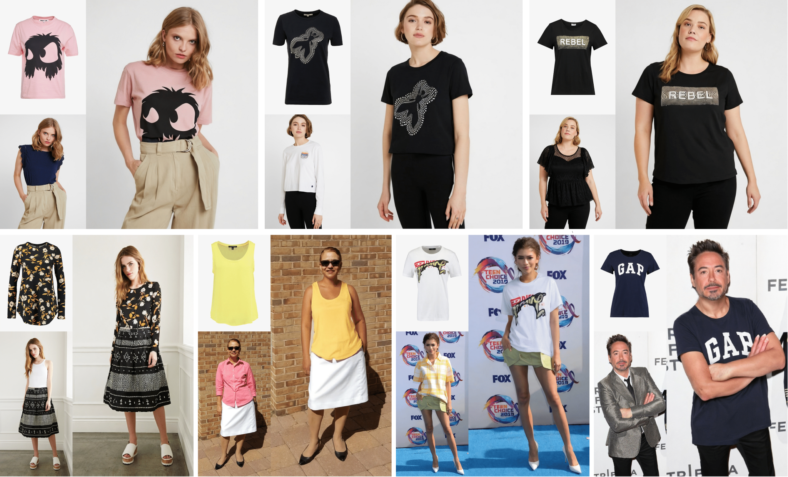

# [CVPR2024] StableVITON: Learning Semantic Correspondence with Latent Diffusion Model for Virtual Try-On 
This repository is the official implementation of [StableVITON](https://arxiv.org/abs/2312.01725)

> **StableVITON: Learning Semantic Correspondence with Latent Diffusion Model for Virtual Try-On**<br>
> [Jeongho Kim](https://scholar.google.co.kr/citations?user=ucoiLHQAAAAJ&hl=ko), [Gyojung Gu](https://www.linkedin.com/in/gyojung-gu-29033118b/), [Minho Park](https://pmh9960.github.io/), [Sunghyun Park](https://psh01087.github.io/), [Jaegul Choo](https://sites.google.com/site/jaegulchoo/) 

[[arXiv Paper](https://arxiv.org/abs/2312.01725)]&nbsp;
[[Project Page](https://rlawjdghek.github.io/StableVITON/)]&nbsp;

&nbsp;

## TODO List
- [x] ~~Inference code~~
- [x] ~~Release model weights~~
- [x] ~~Training code~~

## Environments
```bash
git clone https://github.com/rlawjdghek/StableVITON
cd StableVITON

conda create --name StableVITON python=3.10 -y
conda activate StableVITON

# install packages
pip install torch==2.0.0+cu117 torchvision==0.15.1+cu117 torchaudio==2.0.1 --index-url https://download.pytorch.org/whl/cu117
pip install pytorch-lightning==1.5.0
pip install einops
pip install opencv-python==4.7.0.72
pip install matplotlib
pip install omegaconf
pip install albumentations
pip install transformers==4.33.2
pip install xformers==0.0.19
pip install triton==2.0.0
pip install open-clip-torch==2.19.0
pip install diffusers==0.20.2
pip install scipy==1.10.1
conda install -c anaconda ipython -y
```

## Weights and Data
Our [checkpoint](https://kaistackr-my.sharepoint.com/:f:/g/personal/rlawjdghek_kaist_ac_kr/EjzAZHJu9MlEoKIxG4tqPr0BM_Ry20NHyNw5Sic2vItxiA?e=5mGa1c) on VITONHD have been released! <br>
You can download the VITON-HD dataset from [here](https://github.com/shadow2496/VITON-HD).<br>
For both training and inference, the following dataset structure is required:

```
train
|-- image
|-- image-densepose
|-- agnostic
|-- agnostic-mask
|-- cloth
|-- cloth_mask
|-- gt_cloth_warped_mask (for ATV loss)

test
|-- image
|-- image-densepose
|-- agnostic
|-- agnostic-mask
|-- cloth
|-- cloth_mask
```

## Preprocessing
The VITON-HD dataset serves as a benchmark and provides an agnostic mask. However, you can attempt virtual try-on on **arbitrary images** using segmentation tools like [SAM](https://github.com/facebookresearch/segment-anything). Please note that for densepose, you should use the same densepose model as used in VITON-HD.

## Inference
```bash
#### paired
CUDA_VISIBLE_DEVICES=4 python inference.py \
 --config_path ./configs/VITONHD.yaml \
 --batch_size 4 \
 --model_load_path <model weight path> \
 --save_dir <save directory>

#### unpaired
CUDA_VISIBLE_DEVICES=4 python inference.py \
 --config_path ./configs/VITONHD.yaml \
 --batch_size 4 \
 --model_load_path <model weight path> \
 --unpair \
 --save_dir <save directory>

#### paired repaint
CUDA_VISIBLE_DEVICES=4 python inference.py \
 --config_path ./configs/VITONHD.yaml \
 --batch_size 4 \
 --model_load_path <model weight path>t \
 --repaint \
 --save_dir <save directory>

#### unpaired repaint
CUDA_VISIBLE_DEVICES=4 python inference.py \
 --config_path ./configs/VITONHD.yaml \
 --batch_size 4 \
 --model_load_path <model weight path> \
 --unpair \
 --repaint \
 --save_dir <save directory>
```

You can also preserve the unmasked region by '--repaint' option. 

## Training
For VITON training, we increased the first block of U-Net from 9 to 13 channels (add zero conv) based on the Paint-by-Example (PBE) model. Therefore, you should download the modified checkpoint (named as 'VITONHD_PBE_pose.ckpt') from the [Link](https://kaistackr-my.sharepoint.com/:f:/g/personal/rlawjdghek_kaist_ac_kr/EjzAZHJu9MlEoKIxG4tqPr0BM_Ry20NHyNw5Sic2vItxiA?e=5mGa1c) and place it in the './ckpts/' folder first.

Additionally, for more refined person texture, we utilized a VAE fine-tuned on the VITONHD dataset. You should also download the checkpoint (named as VITONHD_VAE_finetuning.ckpt') from the [Link](https://kaistackr-my.sharepoint.com/:f:/g/personal/rlawjdghek_kaist_ac_kr/EjzAZHJu9MlEoKIxG4tqPr0BM_Ry20NHyNw5Sic2vItxiA?e=5mGa1c) and place it in the './ckpts/' folder.

```bash
### Base model training
CUDA_VISIBLE_DEVICES=3,4 python train.py \
 --config_name VITONHD \
 --transform_size shiftscale3 hflip \
 --transform_color hsv bright_contrast \
 --save_name Base_test

### ATV loss finetuning
CUDA_VISIBLE_DEVICES=5,6 python train.py \
 --config_name VITONHD \
 --transform_size shiftscale3 hflip \
 --transform_color hsv bright_contrast \
 --use_atv_loss \
 --resume_path <first stage model path> \
 --save_name ATVloss_test
```

## Citation
If you find our work useful for your research, please cite us:
```
@artical{kim2023stableviton,
    title={StableVITON: Learning Semantic Correspondence with Latent Diffusion Model for Virtual Try-On},
    author={Kim, Jeongho and Gu, Gyojung and Park, Minho and Park, Sunghyun and Choo, Jaegul},
    booktitle={arXiv preprint arxiv:2312.01725},
    year={2023}
}
```

**Acknowledgements** Sunghyun Park is the corresponding author.

## License
Licensed under the CC BY-NC-SA 4.0 license (https://creativecommons.org/licenses/by-nc-sa/4.0/legalcode).
